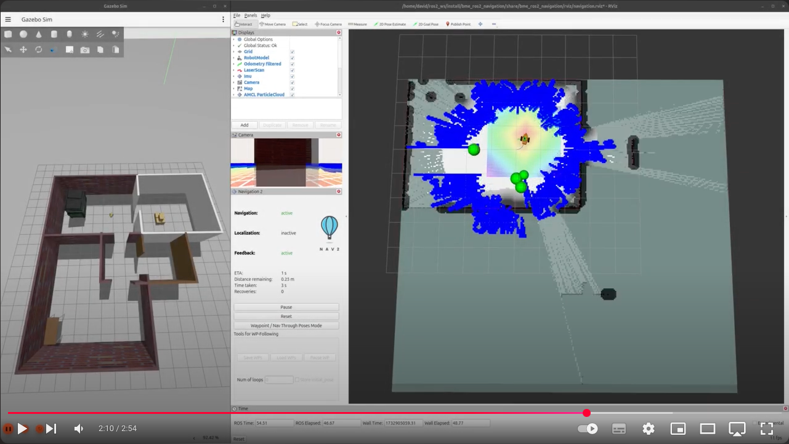

[//]: # (Image References)

[image1]: ./assets/starter-package.png "Starter package"
[image2]: ./assets/rqt-graph.png "rqt_graph"
[image3]: ./assets/tf-tree.png "rqt_tf_tree"
[image4]: ./assets/tf-tree-1.png "rqt_tf_tree"
[image5]: ./assets/mapping.png "mapping"
[image6]: ./assets/save-map.png "Save map"
[image7]: ./assets/load-map.png "Load map"
[image8]: ./assets/load-map-1.png "Load map"

# Week 7-8: Navigation

## This is how far we will get by the end of this lesson: 
  <a href="https://youtu.be/NkOX4zX9XbQ"></a>  


# Table of Contents
1. [Introduction](#introduction)  
1.1. [Download ROS package](#download-ros-package)  
1.2. [Test the starter package](#test-the-starter-package)  
2. [Mapping](#mapping)  
2.1. [SLAM toolbox](#slam-toolbox)  
3. [Localization](#localization)  
3.1. [Localization with AMCL](#localization-with-amcl)  
3.2. [Localization with SLAM toolbox](#localization-with-slam-toolbox)  
4. [Navigation](#navigation)  
4.1. [Waypoint navigation](#waypoint-navigation)  
3.1. [Navigation with SLAM](#amcl)  
5. [Exploration](#exploration)  

# Introduction

In this lesson we'll lear how to map the robot's environment, how to do localization on an existing map and we'll learn to use ROS2's navigation stack.

## Download ROS package

To download the starter package, clone the following git repo with the `starter-branch` (using the `-b branch` flag) into your colcon workspace:
```bash
git clone -b starter-branch https://github.com/MOGI-ROS/Week-7-8-ROS2-Navigation
```

Let's take a look what's inside the `bme_ros2_navigation` package with the `tree` command!


```bash
.
├── CMakeLists.txt
├── package.xml
├── config
│   ├── amcl_localization.yaml
│   ├── ekf.yaml
│   ├── gz_bridge.yaml
│   ├── navigation.yaml
│   ├── slam_toolbox_localization.yaml
│   └── slam_toolbox_mapping.yaml
├── launch
│   ├── check_urdf.launch.py
│   ├── spawn_robot.launch.py
│   └── world.launch.py
├── maps
│   ├── my_map.pgm
│   ├── my_map.yaml
│   ├── serialized.data
│   └── serialized.posegraph
├── meshes
│   ├── lidar.dae
│   ├── mogi_bot.dae
│   └── wheel.dae
├── rviz
│   ├── localization.rviz
│   ├── mapping.rviz
│   ├── navigation.rviz
│   ├── rviz.rviz
│   └── urdf.rviz
├── urdf
│   ├── materials.xacro
│   ├── mogi_bot.gazebo
│   └── mogi_bot.urdf
└── worlds
    ├── empty.sdf
    └── home.sdf
```

Let's see what will we do with the existing files and folders:
- `config`: As we saw previously, we usually store parameters and large configuration files for ROS packages which aren't comfortable to handle from the launchfiles directly. In this lesson we will use more configuration files from this folder.
- `launch`: Default launch files are already part of the starting package, we can test the package with `spawn_robot.launch.py`.
- `maps`: Offline map files for the Gazebo world
- `meshes`: this folder contains the 3D models in `dae` format (collada mesh) that we use for our robot's body, wheels and lidar sensor.
- `rviz`: Pre-configured RViz2 layouts
- `urdf`: The URDF models of our robot, we'll extend the `mogi_bot.urdf` and `gazebo` files through this lesson
- `worlds`: default Gazebo worlds that we'll use in the simulations.

We have another package `bme_ros2_navigation_py` for our python scripts:
```bash
.
├── bme_ros2_navigation_py
│   ├── follow_waypoints.py
│   ├── __init__.py
│   ├── map_republisher.py
│   ├── send_initialpose.py
│   └── slam_toolbox_load_map.py
├── package.xml
├── resource
│   └── bme_ros2_navigation_py
├── setup.cfg
└── setup.py
```

## Test the starter package

After we downloaded the `starter-branch` from GitHub, let's rebuild the workspace and source the `install/setup.bash` file to make sure ROS and its tools are aware about the new package. Before we test it let's take a look on the `spawn_robot.launch.py`, we'll notice a few important changes!
- This package uses ekf sensor fusion by default, we don't forward the `tf` transformations from Gazebo, because it's done by the `robot_localization` package.
- We moved all the `parameter_bridge` topics into a yaml config file `gz_bridge.yaml`, we don't describe them in the launch file anymore, this is more comfortable when we forward many topics.
- There is a new node in the launch file `marker_server` from the `interactive-marker-twist-server` this can be used to move and rotate our robot directly from RViz. Let's install it with `sudo apt install ros-jazzy-interactive-marker-twist-server`!

Now we are ready to test the package with the usual launch file:
```bash
ros2 launch bme_ros2_navigation spawn_robot.launch.py
```

![alt text][image1]

Let's see the `rqt_graph` tool to see the connections between the nodes:
![alt text][image2]

And also try the `rqt_tf_tree`:

```bash
ros2 run rqt_tf_tree rqt_tf_tree
```

![alt text][image3]

# Mapping

Let's learn how to create the map of the robot's surrounding. In practice we are using SLAM algorithms, SLAM stands for Simultaneous Localization and Mapping. It is a fundamental technique in robotics (and other fields) that allows a robot to:
1.	Build a map of an unknown environment (mapping).
2.	Track its own pose (position and orientation) within that map at the same time (localization).

Usually SLAM algorythms consists of 4 core functionalities:
1.	Sensor inputs  
SLAM typically uses sensor data (e.g., LIDAR scans, camera images, or depth sensor measurements) to detect features or landmarks in the environment.
2.	State estimation  
An internal state (the robot’s pose, including x, y, yaw) is estimated using algorithms like Extended Kalman Filters, Particle Filters, or Graph Optimization.
3.	Map building  
As the robot moves, it accumulates new sensor data. The SLAM algorithm integrates that data into a global map (2D grid map, 3D point cloud, or other representations).
4.	Loop closure  
When the robot revisits a previously mapped area, the SLAM algorithm detects that it’s the same place (loop closure). This knowledge is used to reduce accumulated drift and refine both the map and pose estimates.

## SLAM Toolbox

In this lesson we will use the `slam_toolbox` package that has to be installed first:

```bash
sudo apt install ros-jazzy-slam-toolbox
```

After installing it we will create a new launch file for mapping, the `slam_toolbox` parameters are already in the `config` folder (`slam_toolbox_mapping.yaml`) we'll use these parameters. Let's also move the `interactive_twist_marker` and RViz related functions into the new launch file from `spawn_robot.launch.py`.

```python
    #launchDescriptionObject.add_action(rviz_launch_arg)
    #launchDescriptionObject.add_action(rviz_config_arg)
    launchDescriptionObject.add_action(world_arg)
    launchDescriptionObject.add_action(model_arg)
    launchDescriptionObject.add_action(x_arg)
    launchDescriptionObject.add_action(y_arg)
    launchDescriptionObject.add_action(yaw_arg)
    launchDescriptionObject.add_action(sim_time_arg)
    launchDescriptionObject.add_action(world_launch)
    #launchDescriptionObject.add_action(rviz_node)
    launchDescriptionObject.add_action(spawn_urdf_node)
    launchDescriptionObject.add_action(gz_bridge_node)
    launchDescriptionObject.add_action(gz_image_bridge_node)
    launchDescriptionObject.add_action(relay_camera_info_node)
    launchDescriptionObject.add_action(robot_state_publisher_node)
    launchDescriptionObject.add_action(trajectory_node)
    launchDescriptionObject.add_action(ekf_node)
    #launchDescriptionObject.add_action(interactive_marker_twist_server_node)
```

Also change the `reference_frame_id` of `mogi_trajectory_server` from `odom` to `map` because this will be our new reference frame when we have a map!

```python
    trajectory_node = Node(
        package='mogi_trajectory_server',
        executable='mogi_trajectory_server',
        name='mogi_trajectory_server',
        parameters=[{'reference_frame_id': 'map'}]
    )
```

Let's create `mapping.launch.py`:

```python
import os
from launch import LaunchDescription
from launch.actions import DeclareLaunchArgument, IncludeLaunchDescription
from launch.conditions import IfCondition
from launch.launch_description_sources import PythonLaunchDescriptionSource
from launch.substitutions import LaunchConfiguration, PathJoinSubstitution, Command
from launch_ros.actions import Node
from ament_index_python.packages import get_package_share_directory

def generate_launch_description():

    pkg_bme_ros2_navigation = get_package_share_directory('bme_ros2_navigation')

    gazebo_models_path, ignore_last_dir = os.path.split(pkg_bme_ros2_navigation)
    os.environ["GZ_SIM_RESOURCE_PATH"] += os.pathsep + gazebo_models_path

    rviz_launch_arg = DeclareLaunchArgument(
        'rviz', default_value='true',
        description='Open RViz'
    )

    rviz_config_arg = DeclareLaunchArgument(
        'rviz_config', default_value='mapping.rviz',
        description='RViz config file'
    )

    sim_time_arg = DeclareLaunchArgument(
        'use_sim_time', default_value='True',
        description='Flag to enable use_sim_time'
    )

    # Generate path to config file
    interactive_marker_config_file_path = os.path.join(
        get_package_share_directory('interactive_marker_twist_server'),
        'config',
        'linear.yaml'
    )

    # Path to the Slam Toolbox launch file
    slam_toolbox_launch_path = os.path.join(
        get_package_share_directory('slam_toolbox'),
        'launch',
        'online_async_launch.py'
    )

    slam_toolbox_params_path = os.path.join(
        get_package_share_directory('bme_ros2_navigation'),
        'config',
        'slam_toolbox_mapping.yaml'
    )

    # Launch rviz
    rviz_node = Node(
        package='rviz2',
        executable='rviz2',
        arguments=['-d', PathJoinSubstitution([pkg_bme_ros2_navigation, 'rviz', LaunchConfiguration('rviz_config')])],
        condition=IfCondition(LaunchConfiguration('rviz')),
        parameters=[
            {'use_sim_time': LaunchConfiguration('use_sim_time')},
        ]
    )

    interactive_marker_twist_server_node = Node(
        package='interactive_marker_twist_server',
        executable='marker_server',
        name='twist_server_node',
        parameters=[interactive_marker_config_file_path],
        output='screen',
    )

    slam_toolbox_launch = IncludeLaunchDescription(
        PythonLaunchDescriptionSource(slam_toolbox_launch_path),
        launch_arguments={
                'use_sim_time': LaunchConfiguration('use_sim_time'),
                'slam_params_file': slam_toolbox_params_path,
        }.items()
    )

    launchDescriptionObject = LaunchDescription()

    launchDescriptionObject.add_action(rviz_launch_arg)
    launchDescriptionObject.add_action(rviz_config_arg)
    launchDescriptionObject.add_action(sim_time_arg)
    launchDescriptionObject.add_action(rviz_node)
    launchDescriptionObject.add_action(interactive_marker_twist_server_node)
    launchDescriptionObject.add_action(slam_toolbox_launch)

    return launchDescriptionObject
```

Build the workspace and we'll need 2 terminals, in the first we launch the simulation like before (but this time it won't open RViz):
```bash
ros2 launch bme_ros2_navigation spawn_robot.launch.py
```

And in another terminal we launch the new `mapping.launch.py`:

```bash
ros2 launch bme_ros2_navigation mapping.launch.py
```

Let's take a look first on `rqt_tf_tree`:

```bash
ros2 run rqt_tf_tree rqt_tf_tree
```

![alt text][image4]

We can see an additional frame `map` over the `odom` odometry frame. We can also visualize this transformation in RViz:
![alt text][image5]

The difference between the `odom` and `map` frames show the accumulated drift of our odometry over time. don't forget that this is already improved a lot thanks to the sensor fusion between the raw odometry and the IMU.

With SLAM Toolbox we can also save the maps, we have two options:
1) `Save Map`: The map is saved as a `.pgm` file and a `.yaml` file. This is a black and white image file that can be used with other ROS nodes for localization as we will see later. Since it's only an image file it's impossible to continue the mapping with such a file because SLAM Toolbox handles the map in the background as a graph that cannot be restored from an image.
2) `Serialize Map`: With this feature we can serialize and later deserialize SLAM Toolbox's graph, so it can be loaded and the mapping can be continued. Although other ROS nodes won't be able to read or use it for localization.

![alt text][image6]

After saving a serialized map next time we can load (deserialize it):
![alt text][image7]

And we can also load the map that is in the starter package of this lesson:
![alt text][image8]

We can also use a custom node to deserialize the already saved map, it implements the same functionality as the `Deserialize Map` button in RViz:

```bash
ros2 run bme_ros2_navigation_py slam_toolbox_load_map
```


---


Map saving:
sudo apt install ros-jazzy-nav2-map-server

ros2 run nav2_map_server map_saver_cli -f my_map

Localization:
sudo apt install ros-jazzy-nav2-bringup 

Exploration:

ros2 launch explore_lite explore.launch.py